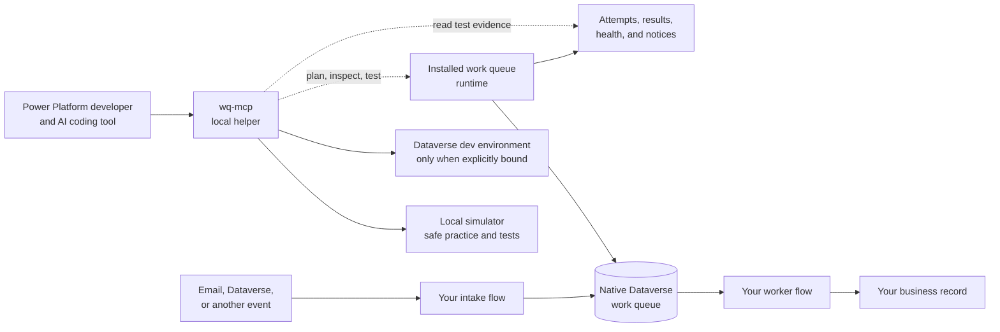

# Power Automate Work Queue Framework

Build safer Power Automate work queues with help from an MCP server.

This project gives a Power Platform developer a small local helper. You can use it with an AI coding tool to plan, build, test, and check a work queue. The MCP uses the same work queue pattern that your Power Automate flows use.

MCP means Model Context Protocol. In this project, it is a local bridge that lets your AI tool use safe project actions.

## How it fits together



The solid arrows show production work. The dotted arrows show help for the developer. The MCP is not the production worker. Your installed runtime keeps working when the AI tool is closed.

## What the MCP offers

For a typical Power Platform project, the MCP can:

- inspect the local setup and the chosen development environment;
- make a safe plan before a change;
- create starter files for your intake and worker flows;
- check those files for changes or missing parts;
- create a local queue for practice;
- start a test run and read the saved results;
- show queue health and item status;
- cancel a waiting test;
- clean up records made by a successful test; and
- apply an approved development import and show its status.

The MCP does not replace Power Automate, Dataverse, or your business flows. It does not run your production queue. It does not install to production. A live development action needs an explicit environment binding and the right access.

## A simple developer flow

1. Ask your AI tool to inspect the project.
2. Plan the queue and review the plan.
3. Create starter flow files for your customer solution.
4. Check the files before you import them.
5. Run a test and read the saved evidence.
6. Import to a development environment only after review.
7. Use Power Platform to finish setup, test real connectors, and approve the result.

## Current state

This is a local development candidate, not a production release. The repository includes a local runtime, simulator, Dataverse adapter, MCP server, solution sources, flow scaffolds, and tests. The local tools need no tenant, mailbox, AI service, or Power Platform credential.

Live tenant checks are still required for native queue behavior, security, connector setup, solution import, and platform limits. The 22 live acceptance gates remain open.

## Start here

- [Local build and demonstration](docs/local-development.md)
- [Verified local candidate](docs/local-evidence.md)
- [Development import results](docs/live-import.md)
- [Delayed retry proof](docs/delayed-retry-proof.md)
- [First import runbook](docs/first-import.md)
- [Implementation decisions and limits](docs/implementation-decisions.md)
- [Local evidence and live gates](docs/validation.md)
- [Proposed architecture](docs/architecture.md)
- [Tracking agreement and Definition of Done](docs/project-tracking.md)
- [Readable build plan](docs/backlog-index.md)
- [Build board](https://github.com/users/EricLott/projects/2)

## Run the local build

```powershell
./scripts/build.ps1
./scripts/test.ps1
```

To start the MCP server:

```powershell
node src/mcp/server.js
```

Configure your MCP host to launch that command from this repository. By default, the MCP uses local simulation. See [local development](docs/local-development.md) for live development binding, test details, and limits.

Publisher prefix: `qmcp`.
